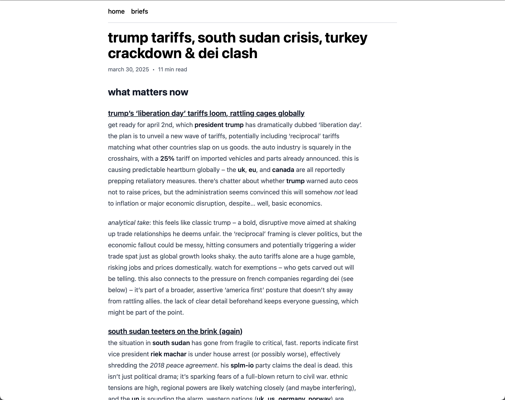
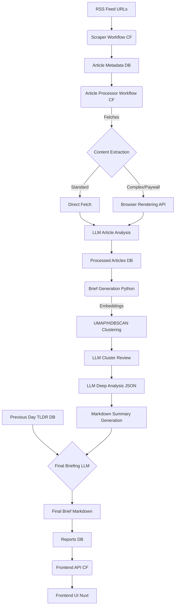

# Meridian: Your Personal Intelligence Agency

[](https://github.com/iliane5/meridian/actions/workflows/deploy-services.yaml)
[](https://opensource.org/licenses/MIT)

**Presidential-level intelligence briefings, built with AI, tailored for you.**

Meridian cuts through news noise by scraping hundreds of sources, analyzing stories with AI, and delivering concise, personalized daily briefs.

<p align="center">
  
</p>

## Why It Exists

Presidents get tailored daily intelligence briefs. Now with AI, you can too. Meridian delivers:

- Key global events filtered by relevance
- Context and underlying drivers
- Analysis of implications
- Open-source transparency

Built for the curious who want depth beyond headlines without the time sink.

## Key Features

- **Source Coverage**: Hundreds of diverse news sources
- **AI Analysis**: Multi-stage LLM processing (Gemini) for article and cluster analysis
- **Smart Clustering**: Embeddings + UMAP + HDBSCAN to group related articles
- **Personalized Briefing**: Daily brief with analytical voice and continuity tracking
- **Web Interface**: Clean Nuxt 3 frontend

## How It Works



1. **Scraping**: Cloudflare Workers fetch RSS feeds, store metadata
2. **Processing**: Extract text, analyze with Gemini for relevance and structure
3. **Brief Generation**: Cluster articles, generate analysis, synthesize final brief
4. **Frontend**: Display briefs via Nuxt/Cloudflare

## Tech Stack

- **Infrastructure**: Turborepo, Cloudflare (Workers, Workflows, Pages)
- **Backend**: Hono, TypeScript, PostgreSQL, Drizzle
- **AI/ML**: Gemini models, multilingual-e5-small embeddings, UMAP, HDBSCAN
- **Frontend**: Nuxt 3, Vue 3, Tailwind

## Setup

**Prerequisites**: Node.js v22+, pnpm v9.15+, Python 3.10+, PostgreSQL, Cloudflare account, Google AI API key

```bash
git clone https://github.com/iliane5/meridian.git
cd meridian
pnpm install
# Configure .env files
pnpm --filter @meridian/database migrate
# Deploy via Wrangler, run Python briefing notebook manually
```

## Status & Next Steps

- ✅ **Core Pipeline**: Scraping, processing, analysis working
- ⏳ **Top Priority**: Automate brief generation (currently manual Python notebook)
- ⚠️ **Monitoring**: Improve scraping robustness
- 🔜 **Future**: Add testing, newsletter distribution

## AI Collaboration

This project benefited significantly from AI assistance:

- **Claude 3.7 Sonnet**: Contributed to early architecture brainstorming, generated browser js scraping scripts, refined prompts, and called me out when I was overthinking or overengineering.
- **Gemini 2.5 Pro**: Excelled with long-context tasks - comparing outputs across different prompt variants, reviewing the entire codebase before opensourcing, and nailing the analytical tone for briefs
- **Gemini 2.0 Flash**: The true unsung hero of this project - blazing fast, dirt cheap, and surprisingly capable when prompted well. It's the workhorse that makes running meridian economically viable without sponsors or grants. Essentially free intelligence at scale.

The first two compressed months of dev work into days and made building this way more fun. But Flash isn't just a time-saver—it's the engine that makes Meridian possible at all. No human is reading 2000+ articles daily and analyzing 100+ story clusters. Having AI peers for brainstorming felt like cheating; having AI workers for the actual intelligence pipeline feels like living in the future.

## License

MIT License - See [LICENSE](./LICENSE) file for details.

---

_Built because we live in an age of magic, and we keep forgetting to use it._
